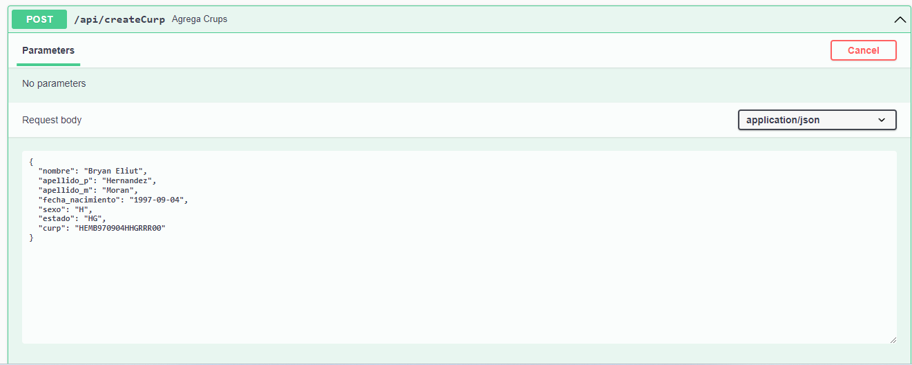

 
# Sonetasot CURP test
Esta repositorio contine dos proyectos:

`fornt-end` el cual es muestra la maquetacion de 2 pantallas del arichivo compartido. 

`back-end` el cual es un CRUD donde se puenden agregar curp(s) con los datos corespondientes con las siguientes validaciones:

- Nombre Obligatorio. 
- Apellido Materno Obligatorio. 
- Apellido Paterno Obligatorio. 
- Sexo Obligatorio, siendo H o M las unicas opciones.
- Estado Obligatorio, siedno las abreviaciones a 2 letras de los estado las unicas opciones.
- curp Obligatrio, Se valida formato de curp, Valida curp con la informacion antes porporcionada, Validacion de Curp unico.

Este proyecto se hizo como examen tecnico para Sonetasot, donde se construyo una pequeña API usando laravel con swagger como cliente y un despliegue usando Docker.

## Correr local mente  

Clonar el projecto  

~~~bash  
  git clone https://github.com/bhdzit/sonetasot_curp.git
~~~

Entramos al directorio  

~~~bash  
  cd sonetasot_curp
~~~

Crear he iniciar contenedores
~~~bash  
docker-compose up
~~~

Correr migraciones de laravel
~~~bash  
docker-compose exec php-fpm php artisan migrate
~~~

Accedes a la documentacion de la API

~~~bash  
http://localhost:81/api/documentation
~~~

Accedes a maquetacion de pantallas
~~~bash  
http://localhost:81/api/documentation
~~~

## Screenshots  

`Base de documentacion en swagger`

`Error en request`

`Cuerpo de un request correcto`

`Maquetacion de primera pantalla`

`Maquetacion de segunda pantalla`

## Feedback  

Cualquier feedback, por favor contactarme al bhdzit97@gmail.com

